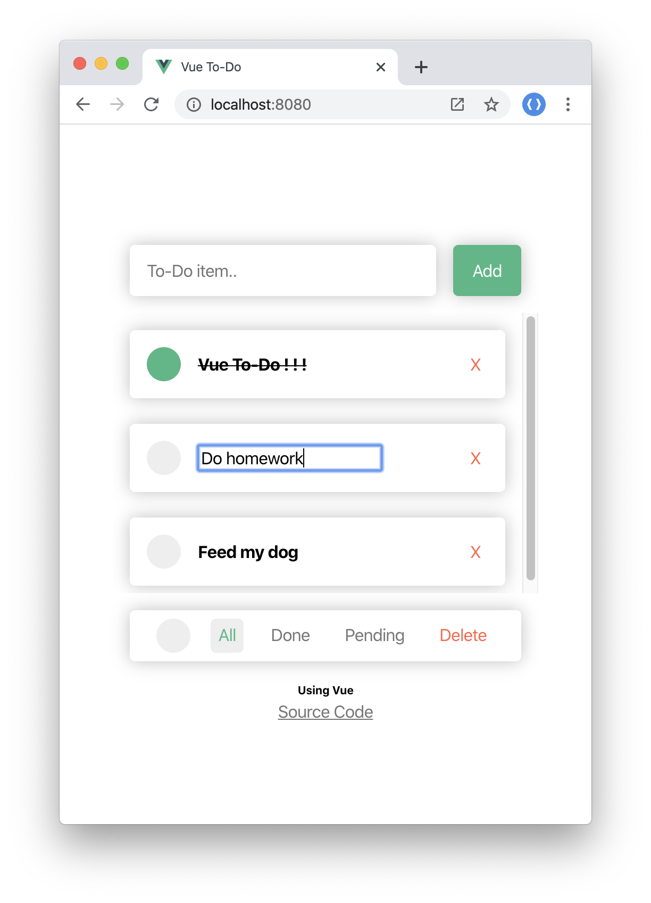

# Vue To-Do



- Add To-Do item
- Set done/pending status
- Edit To-Do item
- Delete To-Do item
- Set all items to done/pending status
- Delete done items

## Project setup
```
npm install
```

### Compiles and hot-reloads for development
```
npm run serve
```

### Compiles and minifies for production
```
npm run build
```

### Lints and fixes files
```
npm run lint
```

### Customize configuration
See [Configuration Reference](https://cli.vuejs.org/config/).
